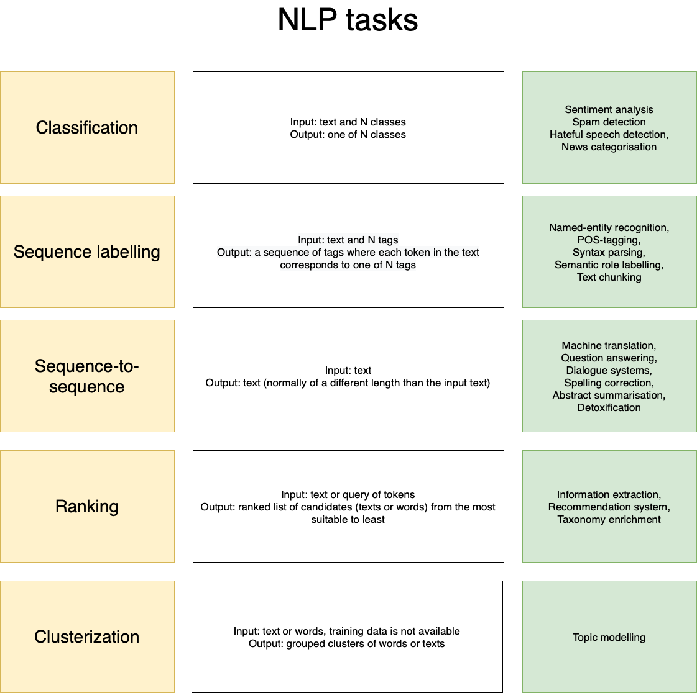

# Neural NLP course for CL-2022

## Wednesdays, 14:40 msk

zoom link: https://uni-hamburg.zoom.us/j/68413791189?pwd=dFMzQVdrV0xQbC91ZVp0T2d3VVlUQT09

Background quiz: https://forms.gle/JFVf5NMmxQ6hxVGXA

Project & RG tables: https://docs.google.com/spreadsheets/d/1xxeQzSzo50DzOI6LcdPkECUcDTOW0JpzhIf6uWcnUBA/edit?usp=sharing

tg link: https://t.me/+jEhCROivh_Y5OTEy

__________________________________________

## Grading

https://docs.google.com/spreadsheets/d/1uGmHJxa7sXD5zpzj_tAyiFn_x3JU_rYPEjPP_Eb9-uU/edit?usp=sharing

__________________________________________

## HW-1 (Deadline: November 6, 23:59)

Task description: https://drive.google.com/file/d/1UiGlQxNk3EMMaIyfFhJOyhMF_6IG6o61/view?usp=sharing

Google form link to submit: https://forms.gle/4VTUgA1ro87opfew6 

__________________________________________

## Timetable

| Date | Type | Topic | Reading club | Slides/Colab link | Video | Additional links |
|:---:|:---:|:---:|:---:|:---:|:---:|:---:|
| Sep 7 | lecture | Intro | - | https://github.com/lilaspourpre/nlp-cl-2022/blob/main/lecture_slides/01-intro_2022.pdf | https://youtu.be/kHt6CAyvkxU |
| Sep 14 | seminar | Preprocessing | - | https://colab.research.google.com/drive/1NUNyYrjIkJD4uprHGGpJxdFHUPry6s_y?usp=sharing https://colab.research.google.com/drive/1NcOhoAkyDBzftNpIFTgoi9BFDan4a_M4?usp=sharing https://colab.research.google.com/drive/1klTnqX5RNnwlC83Ooad4uPK3vqfF7bIc?usp=sharing | https://youtu.be/cGuymVVUje4 |
| Sep 21 | seminar | ML recap | - | https://colab.research.google.com/drive/1f9y9jj_kH4uN_lD1ec64DjZWknlyU9JF?usp=sharing | https://www.youtube.com/watch?v=SZkrxWhI5qM https://www.youtube.com/playlist?list=PLJOzdkh8T5krxc4HsHbB8g8f0hu7973fK https://youtu.be/JyY2nvzS3ws |
| Sep 28 | lecture | Feed-Forward Neural Networks | - | [FFNN slides](https://drive.google.com/file/d/1bsUByH-y0lMUb2ui00fn6Z1PE2LD_PdK/view?usp=sharing), [Lena Voita's materials](https://lena-voita.github.io/nlp_course/text_classification.html), [NN-Intro (slides)](https://github.com/hse-ds/iad-deep-learning/blob/master/2022/lectures/lecture01-intro.pdf), [NN-backprop](https://github.com/hse-ds/iad-deep-learning/blob/master/2021/lectures/lecture02-convnets.pdf) | [part-1](https://box.skoltech.ru/index.php/s/xMc8OXWBbp3kEzm/download?path=%2F&files=lecture-2-lr-and-ffnn-part-1.mp4), [part-2](https://box.skoltech.ru/index.php/s/xMc8OXWBbp3kEzm/download?path=%2F&files=lecture-2-lr-and-ffnn-part-2.mp4)|[What is a Neural Network?](https://youtu.be/aircAruvnKk), [NN-Intro](https://www.youtube.com/watch?v=-VH7bIoxYp8), [NN-backprop](https://youtu.be/2fPB3Je7E98), [MLP intro](https://www.youtube.com/watch?v=lFh6kKYiaZw), [word embeddings](https://youtu.be/InwNEwh6DYk), [MLP forward](https://www.youtube.com/watch?v=4BSupItpCnU&feature=youtu.be), [MLP backward](https://www.youtube.com/watch?v=85hFCYYTsdI&feature=youtu.be) |
| Oct 19 | lecture + seminar | Feed-Forward Neural Networks | Success with Style: Using Writing Style to Predict the Success of Novels | [FFNN_intro](https://github.com/daria-sa/NNmethods_ba_hse21-22/blob/main/02_NN_intro.ipynb), [FFNN (advanced)](https://colab.research.google.com/drive/18diilT4oic0KOVYTROYizvc8A53eA1pn?usp=sharing), [torch intro](https://github.com/daria-sa/NNmethods_ba_hse21-22/blob/main/04_torch_intro.ipynb), [mlp torch](https://github.com/daria-sa/NNmethods_ba_hse21-22/blob/main/7_mlp_torch.ipynb) | [torch tensors](https://youtu.be/HQyx8vK1S4A), [torch dataset](https://youtu.be/s9WPMP8CXnI), [torch linear model](https://youtu.be/52Ky4PP1kmg) |
|  | lecture | Convolutional Neural Networks |  | | |
|  | seminar | Convolutional Neural Networks | - | | |

__________________________________________

## Projects

[CL NNLP 2021 project list](https://docs.google.com/spreadsheets/d/1Ns9NMCW8BHQ65jd0_AeuInYQQdv3G7l7UWzospj9f60/edit#gid=1836570811)

[Skoltech NNLP project list](https://docs.google.com/spreadsheets/d/1Lj8e0ad0fynhipcmAWb_xYCfbRQzWaWdq9M2fdlxZaM/edit?usp=sharing)

[Project 1](https://github.com/roguLINA/NNLP_project), [Project 2](https://drive.google.com/file/d/1v6VQ2HII5HI8drTnjTm7ByXGXI1nSjj7/view?usp=sharing), [Project 3](https://drive.google.com/drive/folders/1NWRl0qbgmmCNGDk9rbvnvIlZ_uoQw6-Y?usp=sharing), [Project 4](https://drive.google.com/file/d/1dyH981W9LGhwpKRd22NuOiutpwPKQsmu/view?usp=sharing), [Project 5](https://drive.google.com/file/d/1DmW2DAGenjs1ssL3XdntRNV8D1oVuhfz/view?usp=sharing)

Other examples can be found on Telegram chat.

__________________________________________

## NLP tasks

